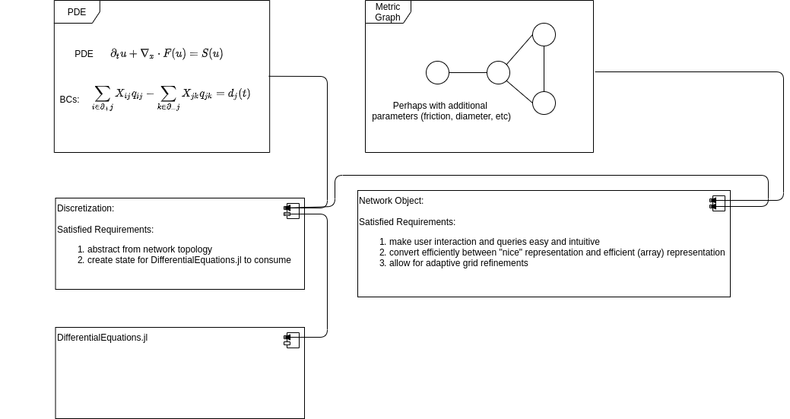

# GraphPDE
  The idea is to consolidate the infrastructure necessary to support utilization of Julia Differential Equations for PDEs defined on metric graphs.
  The package converts to and from a network struct specification to an array specification that plays nicely with Julia Differential Equations.

## Software design

